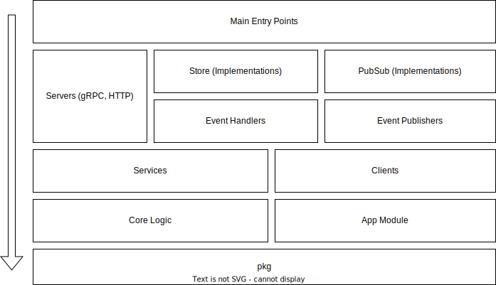

Microservice project structure
==============================

I suggest to use the following project structure for any microservice which usually is deployed using container image
on kubernetes, exposes its core logic through HTTP or gRPC transport layers and interacts with other services using a
message broker, such as kafka.

```text
root/
├── cmd/
│   └── app
├── db/
│   └── migrations
├── docker
├── docs
├── gen
├── internal
│   └── app
│   └── clients
│   └── events
│   └── pubsub
│   └── server
│   └── services
│   └── store
├── k8s
├── pkg
├── scripts
├── templates
└── tools
```

## Root directories

* `cmd` – has one or more subdirectories for the entrypoints of main applications. Subdirectories must have only one
  file – `main.go`.
* `db` – database related resource files should be stored here. Currently, it has only one subdirectory `migrations`
  where all the migrations for Postgres are stored.
* `docker` – is a collection of Dockerfiles.
* `docs` – any documentation or specification file such as `openapi.yaml` should be put in this directory.
* `gen` – most of the generated Go code is put here.
* `internal` – is a place to put all the internal logic related code, that should not be imported by other modules. See
  more about internal directory below.
* `k8s` – is used to store kubernetes manifests.
* `pkg` – the best place for generic utility libraries, for instance, for string manipulation. API clients to interact
  with current service can be put here. Make sure that you don't break contracts during the updates without noticing
  other developers whi relies on your public package. You can prefix all the packages inside the subdirectories
  with `pkg` prefix to avoid any name collisions during the imports.
* `scripts` – the only place to put Bash or Powershell scripts.
* `templates` – is a special directory to put Go template files used for code generation.
* `tools` – code generators or tools used during CI/CD and local development which are usually compiled to the
  executable or run using `go run` command. Each tool should have its own subdirectory.

### Internal directory

`internal` directory has 5 mandatory subdirectories:

* `app` – contains the configuration structs for the application, the global constants and app-specific functions.
  As this package can be imported from any other internal package I recommend to avoid import any internal package from
  app package, to avoid possible cyclic dependencies.
* `events` – any event-sourcing code should be placed in this directory and has its own subdirectory based on its
  domain. For instance, `events/user` or `events/order`. Each subdirectory may have event structs, event handlers
  and event publishers. All the code should be implementation agnostic.
* `pubusb` – the directory where you should put the implementation of event-sourcing code, for example, kafka producers
  and consumers.
* `server` – transport layer code that communicates with core services are placed here. The application might have
  multiple transports: HTTP, gRPC, SOAP. 
* `services` – contains all the Services of the application. Service is an abstract used to encapsulate the logic of a
  single domain module. Examples: `UserService`, `OrderService`, `CartService`. Every services should have its own
  subdirectory and suffixed with `svc` so `UserService` will be placed in `usersvc`, and the package name should be the
  same. The suffix is added to avoid name collision with core logic module that stores structs and methods for domain.
* `clients` – if the application is reliant on 3rd party services, and they are part of the domain level, then we can 
  put them in this subdirectory adding the suffix `client` or `cnt`.  
* `store` – contains the implementation of Stores used in Services and EventHandlers or EventPublisher. The
  implementations are grouped by the implementation provider, for example, Postgres.

We mentioned the core logic code that Services rely on. That code is split into domains and each one should have its own
subdirectory, which is also stored in the `internal` package. For example:

* `user` – it may contain the structs such as `User`, `UserDetail` etc.
* `order` – may contain all the core logic structs and methods related to the order domain.

## Dependency structure

On the image below you can the relationship between all those packages we talked above. Every package can rely on any 
package which is below the former. 


